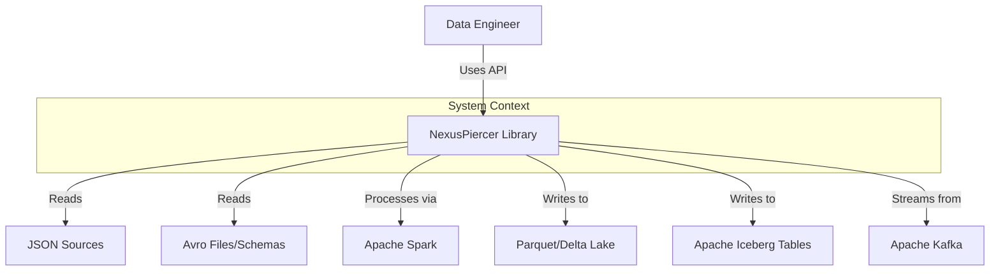
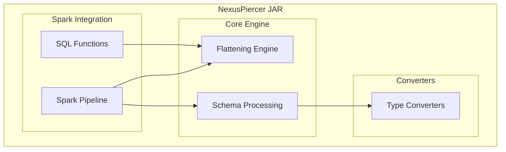
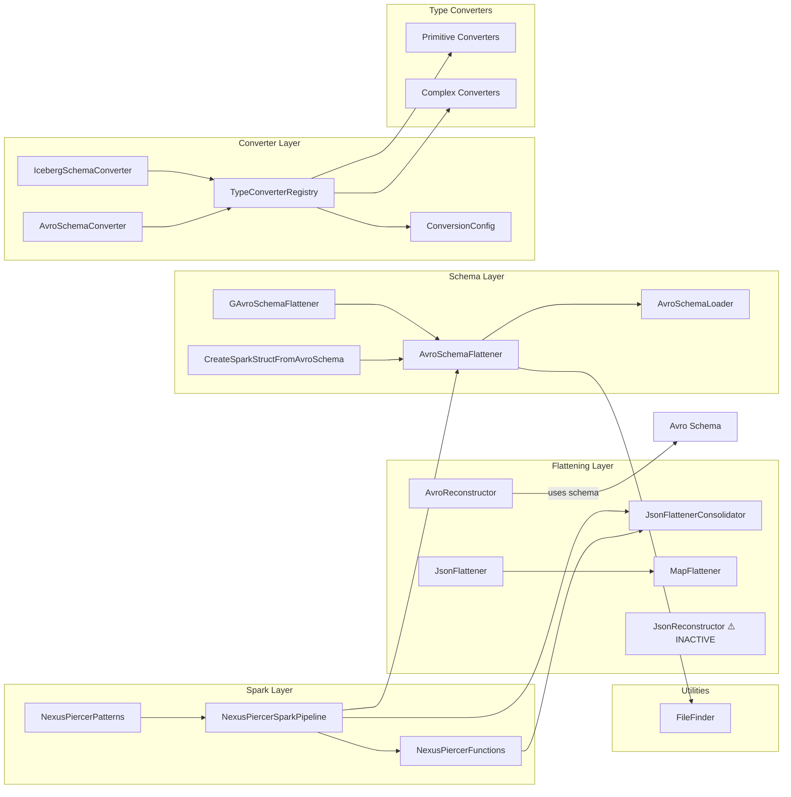
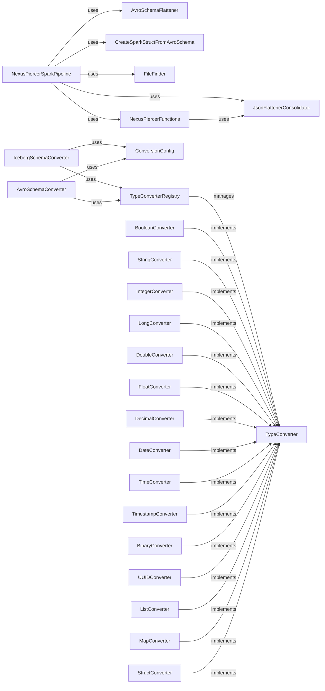
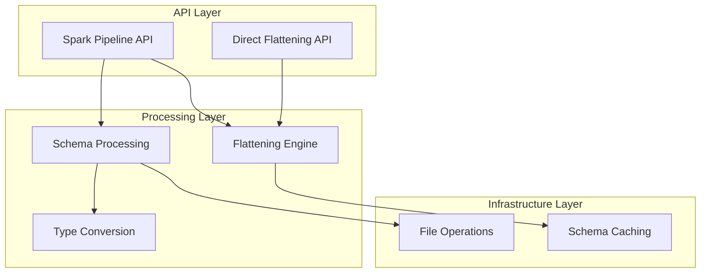
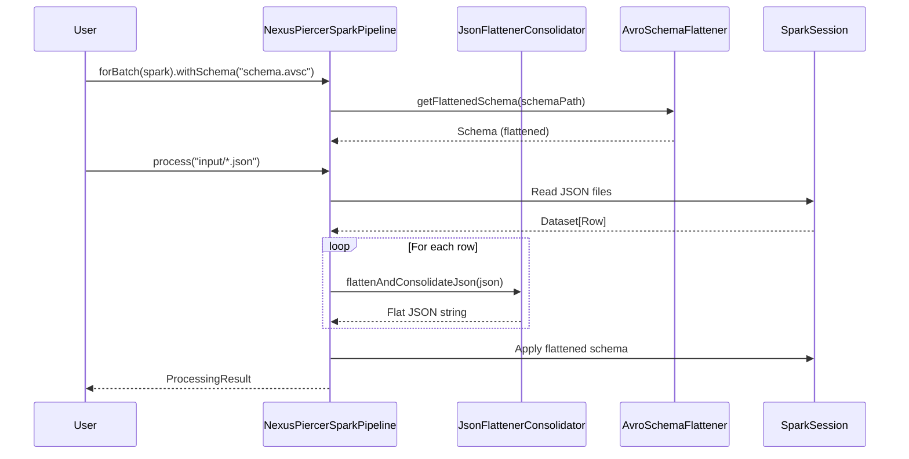

# Architecture Graph — NexusPiercer
> Auto-generated from discovery. Updates as exploration progresses.
> Last Updated: 2025-12-08

## System Context (C4 Level 1)
*External systems and actors that interact with this system*

## Container Diagram (C4 Level 2)
*Major deployable units / processes*

## Component Diagram (C4 Level 3)
*Internal components and their relationships*

## Detailed Dependency Graph
*Class/module level dependencies*

## Layer Diagram
*Architectural layers and allowed dependencies*

## Data Flow Diagram
*How data moves through the system*

## Relationship Registry
*Machine-parseable relationship list*

| Source | Relationship | Target | Evidence |
|--------|--------------|--------|----------|
| NexusPiercerSparkPipeline | DEPENDS_ON | JsonFlattenerConsolidator | import statement |
| NexusPiercerSparkPipeline | DEPENDS_ON | AvroSchemaFlattener | import statement |
| NexusPiercerSparkPipeline | DEPENDS_ON | CreateSparkStructFromAvroSchema | import statement |
| NexusPiercerSparkPipeline | DEPENDS_ON | FileFinder | import statement |
| NexusPiercerSparkPipeline | DEPENDS_ON | SparkSession | constructor param |
| NexusPiercerFunctions | DEPENDS_ON | JsonFlattenerConsolidator | UDF implementation |
| JsonFlattener | DELEGATES_TO | MapFlattener | uses MapFlattener internally |
| AvroReconstructor | DEPENDS_ON | Schema (Avro) | reconstruction requires schema |
| AvroReconstructor | DEPENDS_ON | ObjectMapper | JSON serialization |
| AvroReconstructor | DEPENDS_ON | GenericRecord | output type |
| AvroSchemaConverter | DEPENDS_ON | TypeConverterRegistry | field |
| AvroSchemaConverter | DEPENDS_ON | ConversionConfig | field |
| IcebergSchemaConverter | DEPENDS_ON | TypeConverterRegistry | field |
| IcebergSchemaConverter | DEPENDS_ON | ConversionConfig | field |
| AvroSchemaFlattener | DEPENDS_ON | FileFinder | getFlattenedSchema() |
| AvroSchemaFlattener | DEPENDS_ON | POI | Excel export |
| MapFlattener | DEPENDS_ON | ObjectMapper | field |
| JsonFlattenerConsolidator | DEPENDS_ON | ObjectMapper (Jackson) | JSON processing |
| TypeConverterRegistry | CREATES | *Converter | factory pattern |
| BooleanConverter | IMPLEMENTS | TypeConverter | class declaration |
| StringConverter | IMPLEMENTS | TypeConverter | class declaration |
| IntegerConverter | IMPLEMENTS | TypeConverter | class declaration |
| LongConverter | IMPLEMENTS | TypeConverter | class declaration |
| DoubleConverter | IMPLEMENTS | TypeConverter | class declaration |
| FloatConverter | IMPLEMENTS | TypeConverter | class declaration |
| DecimalConverter | IMPLEMENTS | TypeConverter | class declaration |
| DateConverter | IMPLEMENTS | TypeConverter | class declaration |
| TimeConverter | IMPLEMENTS | TypeConverter | class declaration |
| TimestampConverter | IMPLEMENTS | TypeConverter | class declaration |
| TimestampNanoConverter | IMPLEMENTS | TypeConverter | class declaration |
| BinaryConverter | IMPLEMENTS | TypeConverter | class declaration |
| UUIDConverter | IMPLEMENTS | TypeConverter | class declaration |
| ListConverter | IMPLEMENTS | TypeConverter | class declaration |
| MapConverter | IMPLEMENTS | TypeConverter | class declaration |
| StructConverter | IMPLEMENTS | TypeConverter | class declaration |
