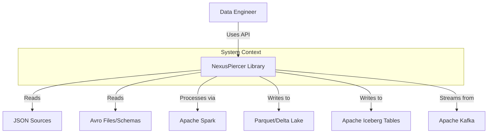
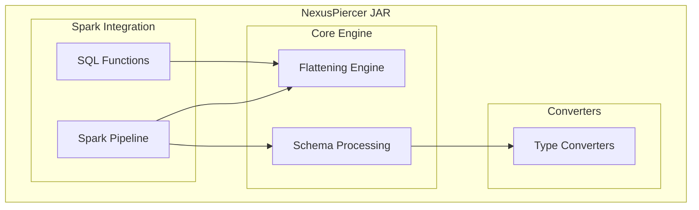
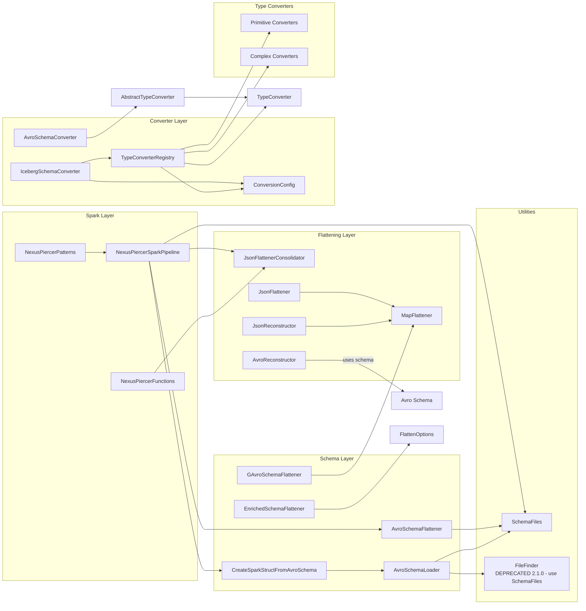
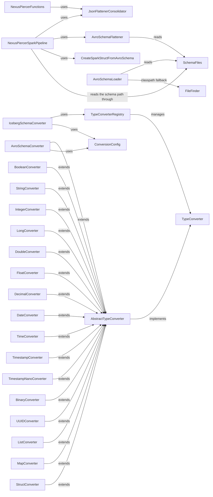
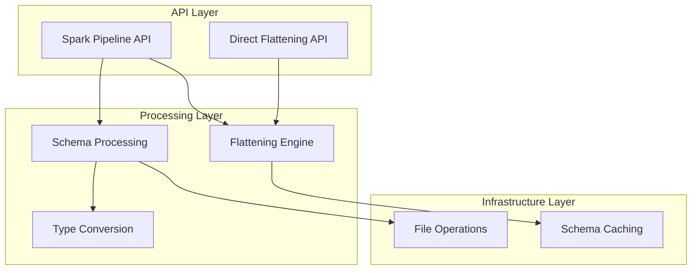
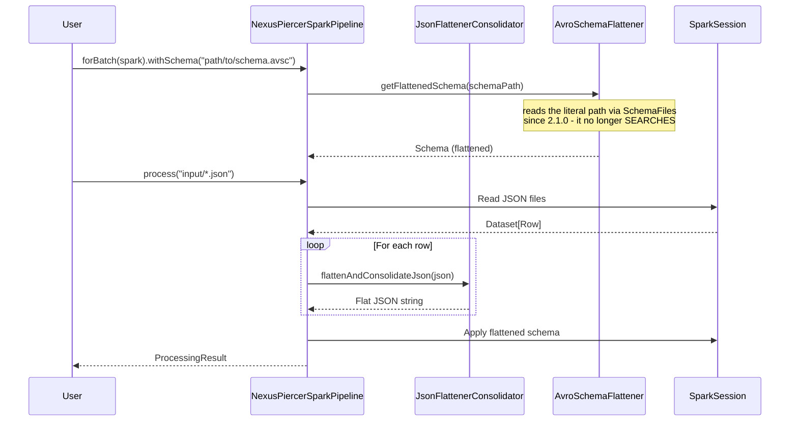

# Architecture Graph — NexusPiercer
> Hand-maintained, NOT auto-generated. Every class-to-class edge below is asserted against the
> source by `ArchitectureGraphEdgesAreRealTest`, so an edge that stops being true fails the build.
> Missing edges are not gated — this is a summary, and a summary is allowed to be incomplete. It
> is not allowed to be wrong.
> Last verified: 2026-08-19 (2.1.0-SNAPSHOT)

## System Context (C4 Level 1)
*External systems and actors that interact with this system*

```mermaid
graph TB
    subgraph "System Context"
        NP[NexusPiercer Library]
    end
    
    DEV[Data Engineer] -->|"Uses API"| NP
    NP -->|"Reads"| JSON_SRC[JSON Sources]
    NP -->|"Reads"| AVRO_SRC[Avro Files/Schemas]
    NP -->|"Processes via"| SPARK[Apache Spark]
    NP -->|"Writes to"| PARQUET[Parquet/Delta Lake]
    NP -->|"Writes to"| ICEBERG[Apache Iceberg Tables]
    NP -->|"Streams from"| KAFKA[Apache Kafka]
```

## Container Diagram (C4 Level 2)
*Major deployable units / processes*

```mermaid
graph TB
    subgraph "NexusPiercer JAR"
        subgraph "Core Engine"
            FLAT[Flattening Engine]
            SCHEMA[Schema Processing]
        end
        
        subgraph "Spark Integration"
            PIPELINE[Spark Pipeline]
            UDF[SQL Functions]
        end
        
        subgraph "Converters"
            CONV[Type Converters]
        end
    end
    
    PIPELINE --> FLAT
    PIPELINE --> SCHEMA
    UDF --> FLAT
    SCHEMA --> CONV
```

## Component Diagram (C4 Level 3)

> **Choosing between the six flatteners?** This diagram shows where they sit in the system. It is
> not the selection rule — that is the family diagram under
> [README's "Which flattener do I use?"](../README.md#which-flattener-do-i-use), which puts all six
> side by side with what each takes, what each emits, and which are covered by the fidelity corpus.
> The two are kept from drifting by `FlattenerFamilyDiagramTest` and
> `ArchitectureGraphEdgesAreRealTest` respectively; the family diagram deliberately lives in README
> rather than here, because this file's edge gate builds one alias map for the WHOLE document and a
> second diagram reusing an id would silently retarget the first one's edges.

*Internal components and their relationships*

```mermaid
graph LR
    subgraph "Spark Layer"
        NPSP[NexusPiercerSparkPipeline]
        NPF[NexusPiercerFunctions]
        NPP[NexusPiercerPatterns]
    end
    
    subgraph "Flattening Layer"
        JFC[JsonFlattenerConsolidator]
        MF[MapFlattener]
        JF[JsonFlattener]
        JR[JsonReconstructor]
        AR[AvroReconstructor]
    end
    
    subgraph "Schema Layer"
        ESF[EnrichedSchemaFlattener]
        ASF[AvroSchemaFlattener]
        ASL[AvroSchemaLoader]
        GASF[GAvroSchemaFlattener]
        CSFS[CreateSparkStructFromAvroSchema]
    end
    
    subgraph "Converter Layer"
        ASC[AvroSchemaConverter]
        ISC[IcebergSchemaConverter]
        TCR[TypeConverterRegistry]
        CC[ConversionConfig]
    end
    
    subgraph "Type Converters"
        TC_PRIM[Primitive Converters]
        TC_COMPLEX[Complex Converters]
    end
    
    subgraph "Utilities"
        SF[SchemaFiles]
        FF["FileFinder<br/>DEPRECATED 2.1.0 - use SchemaFiles"]
    end
    
    NPSP --> JFC
    NPSP --> ASF
    NPSP --> CSFS
    NPSP --> SF
    NPP --> NPSP
    
    NPF --> JFC
    
    JF --> MF
    JR[JsonReconstructor] --> MF
    
    AR --> |"uses schema"| AVRO_SCHEMA[Avro Schema]
    
    ESF --> FO[FlattenOptions]
    ASF --> SF
    ASL --> SF
    ASL --> FF
    GASF --> MF
    CSFS --> ASL
    
    ISC --> TCR
    ISC --> CC
    ASC --> ATC[AbstractTypeConverter]
    ATC --> TC[TypeConverter]
    TCR --> CC
    TCR --> TC
    TCR --> TC_PRIM
    TCR --> TC_COMPLEX
```

## Detailed Dependency Graph
*Class/module level dependencies*

```mermaid
graph LR
    %% Spark Pipeline dependencies
    NPSP[NexusPiercerSparkPipeline] --> |"uses"| JFC[JsonFlattenerConsolidator]
    NPSP --> |"uses"| ASF[AvroSchemaFlattener]
    NPSP --> |"uses"| CSFS[CreateSparkStructFromAvroSchema]
    NPSP --> |"reads the schema path through"| SF[SchemaFiles]
    
    %% Functions dependencies
    NPF[NexusPiercerFunctions] --> |"uses"| JFC
    
    %% Schema reading. FileFinder is deprecated in 2.1.0; only AvroSchemaLoader still has one,
    %% behind SchemaFiles, for its classpath fallback.
    ASF --> |"reads"| SF
    ASL[AvroSchemaLoader] --> |"reads"| SF
    ASL --> |"classpath fallback"| FF[FileFinder]
    
    %% Schema converter dependencies
    ISC[IcebergSchemaConverter] --> |"uses"| TCR[TypeConverterRegistry]
    ISC --> |"uses"| CC[ConversionConfig]
    
    ASC[AvroSchemaConverter] --> |"extends"| ATC[AbstractTypeConverter]
    ASC --> |"uses"| CC
    
    TCR --> |"manages"| TC[TypeConverter]
    ATC --> |"implements"| TC
    
    %% Type converters. Every one of these EXTENDS AbstractTypeConverter, which is what
    %% implements TypeConverter; none of them names TypeConverter directly.
    BOOL[BooleanConverter] --> |"extends"| ATC
    STR[StringConverter] --> |"extends"| ATC
    INT[IntegerConverter] --> |"extends"| ATC
    LONG[LongConverter] --> |"extends"| ATC
    DBL[DoubleConverter] --> |"extends"| ATC
    FLT[FloatConverter] --> |"extends"| ATC
    DEC[DecimalConverter] --> |"extends"| ATC
    DATE[DateConverter] --> |"extends"| ATC
    TIME[TimeConverter] --> |"extends"| ATC
    TS[TimestampConverter] --> |"extends"| ATC
    TSN[TimestampNanoConverter] --> |"extends"| ATC
    BIN[BinaryConverter] --> |"extends"| ATC
    UUID[UUIDConverter] --> |"extends"| ATC
    LIST[ListConverter] --> |"extends"| ATC
    MAP[MapConverter] --> |"extends"| ATC
    STRUCT[StructConverter] --> |"extends"| ATC
```

## Layer Diagram
*Architectural layers and allowed dependencies*

```mermaid
graph TB
    subgraph "API Layer"
        API_SPARK[Spark Pipeline API]
        API_DIRECT[Direct Flattening API]
    end
    
    subgraph "Processing Layer"
        PROC_FLAT[Flattening Engine]
        PROC_SCHEMA[Schema Processing]
        PROC_CONV[Type Conversion]
    end
    
    subgraph "Infrastructure Layer"
        INFRA_FILE[File Operations]
        INFRA_CACHE[Schema Caching]
    end
    
    API_SPARK --> PROC_FLAT
    API_SPARK --> PROC_SCHEMA
    API_DIRECT --> PROC_FLAT
    
    PROC_SCHEMA --> PROC_CONV
    PROC_FLAT --> INFRA_CACHE
    PROC_SCHEMA --> INFRA_FILE
```

## Data Flow Diagram
*How data moves through the system*

```mermaid
sequenceDiagram
    participant User
    participant NPSP as NexusPiercerSparkPipeline
    participant JFC as JsonFlattenerConsolidator
    participant ASF as AvroSchemaFlattener
    participant Spark as SparkSession
    
    User->>NPSP: forBatch(spark).withSchema("path/to/schema.avsc")
    NPSP->>ASF: getFlattenedSchema(schemaPath)
    Note over ASF: reads the literal path via SchemaFiles<br/>since 2.1.0 - it no longer SEARCHES
    ASF-->>NPSP: Schema (flattened)
    
    User->>NPSP: process("input/*.json")
    NPSP->>Spark: Read JSON files
    Spark-->>NPSP: Dataset[Row]
    
    loop For each row
        NPSP->>JFC: flattenAndConsolidateJson(json)
        JFC-->>NPSP: Flat JSON string
    end
    
    NPSP->>Spark: Apply flattened schema
    NPSP-->>User: ProcessingResult
```

## Relationship Registry
*Machine-parseable relationship list*

| Source | Relationship | Target | Evidence |
|--------|--------------|--------|----------|
| NexusPiercerSparkPipeline | DEPENDS_ON | JsonFlattenerConsolidator | import statement |
| NexusPiercerSparkPipeline | DEPENDS_ON | AvroSchemaFlattener | import statement |
| NexusPiercerSparkPipeline | DEPENDS_ON | CreateSparkStructFromAvroSchema | import statement |
| NexusPiercerSparkPipeline | DEPENDS_ON | SchemaFiles | `SchemaFiles.readString(config.schemaPath)` |
| NexusPiercerSparkPipeline | DEPENDS_ON | SparkSession | constructor param |
| NexusPiercerFunctions | DEPENDS_ON | JsonFlattenerConsolidator | UDF implementation |
| JsonFlattener | DELEGATES_TO | MapFlattener | uses MapFlattener internally |
| JsonReconstructor | DEPENDS_ON | MapFlattener | reverses its output |
| GAvroSchemaFlattener | DEPENDS_ON | MapFlattener | names shaped to match its data output |
| EnrichedSchemaFlattener | DEPENDS_ON | FlattenOptions | configuration |
| AvroReconstructor | DEPENDS_ON | Schema (Avro) | reconstruction requires schema |
| AvroReconstructor | DEPENDS_ON | ObjectMapper | JSON serialization |
| AvroReconstructor | DEPENDS_ON | GenericRecord | output type |
| AvroSchemaConverter | EXTENDS | AbstractTypeConverter | class declaration |
| AvroSchemaConverter | DEPENDS_ON | ConversionConfig | field |
| IcebergSchemaConverter | DEPENDS_ON | TypeConverterRegistry | field |
| IcebergSchemaConverter | DEPENDS_ON | ConversionConfig | field |
| AvroSchemaFlattener | DEPENDS_ON | SchemaFiles | `getFlattenedSchema(String)`, since 2.1.0 |
| AvroSchemaLoader | DEPENDS_ON | SchemaFiles | primary read |
| AvroSchemaLoader | DEPENDS_ON | FileFinder | classpath fallback only |
| AvroSchemaFlattener | DEPENDS_ON | POI | Excel export |
| MapFlattener | DEPENDS_ON | ObjectMapper | field |
| JsonFlattenerConsolidator | DEPENDS_ON | ObjectMapper (Jackson) | JSON processing |
| TypeConverterRegistry | CREATES | *Converter | factory pattern |
| TypeConverterRegistry | DEPENDS_ON | TypeConverter | manages instances of it |
| AbstractTypeConverter | IMPLEMENTS | TypeConverter | class declaration |
| BooleanConverter | EXTENDS | AbstractTypeConverter | class declaration |
| StringConverter | EXTENDS | AbstractTypeConverter | class declaration |
| IntegerConverter | EXTENDS | AbstractTypeConverter | class declaration |
| LongConverter | EXTENDS | AbstractTypeConverter | class declaration |
| DoubleConverter | EXTENDS | AbstractTypeConverter | class declaration |
| FloatConverter | EXTENDS | AbstractTypeConverter | class declaration |
| DecimalConverter | EXTENDS | AbstractTypeConverter | class declaration |
| DateConverter | EXTENDS | AbstractTypeConverter | class declaration |
| TimeConverter | EXTENDS | AbstractTypeConverter | class declaration |
| TimestampConverter | EXTENDS | AbstractTypeConverter | class declaration |
| TimestampNanoConverter | EXTENDS | AbstractTypeConverter | class declaration |
| BinaryConverter | EXTENDS | AbstractTypeConverter | class declaration |
| UUIDConverter | EXTENDS | AbstractTypeConverter | class declaration |
| ListConverter | EXTENDS | AbstractTypeConverter | class declaration |
| MapConverter | EXTENDS | AbstractTypeConverter | class declaration |
| StructConverter | EXTENDS | AbstractTypeConverter | class declaration |
| SchemaBasedMapConverter | EXTENDS | AbstractTypeConverter | class declaration |

> Every row above whose Source and Target both name a class under `src/main/java` is asserted by
> `ArchitectureGraphEdgesAreRealTest`. Rows naming a third-party type (`POI`, `ObjectMapper`,
> `SparkSession`) or a wildcard (`*Converter`) are not machine-checkable and are not checked.
