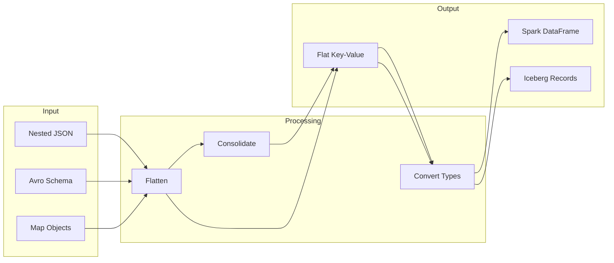
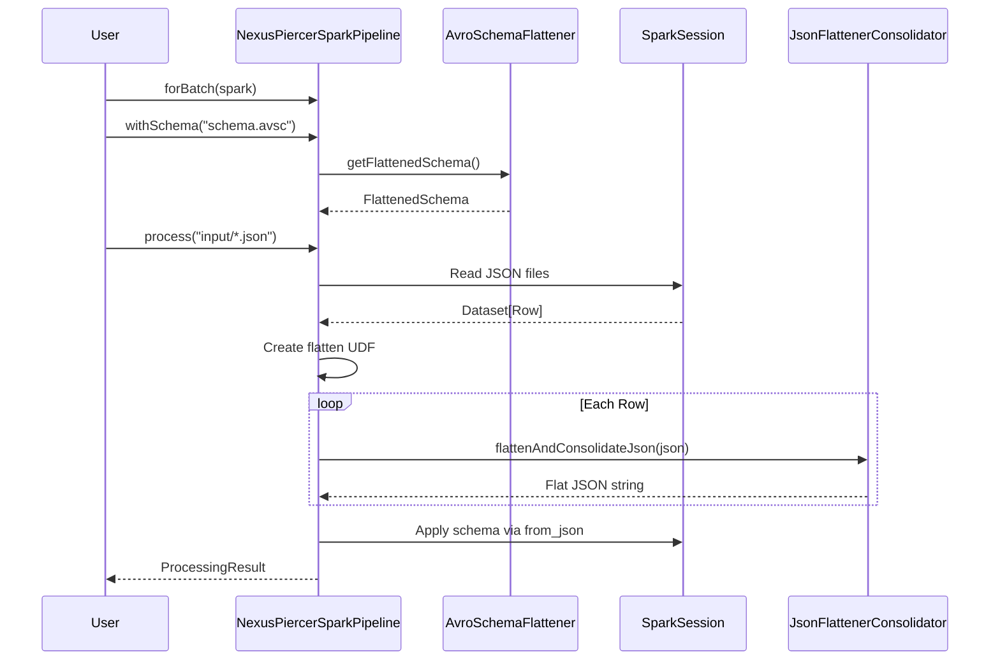
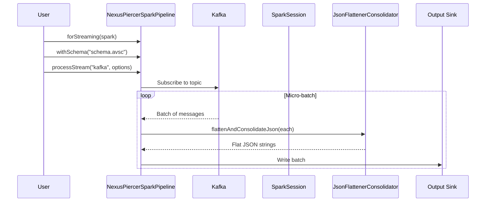
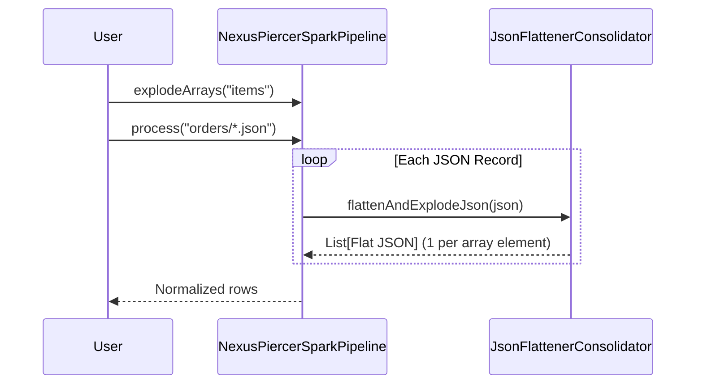
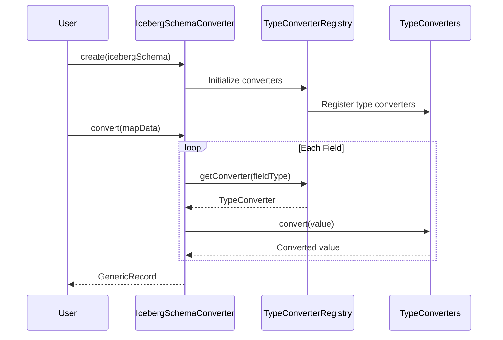
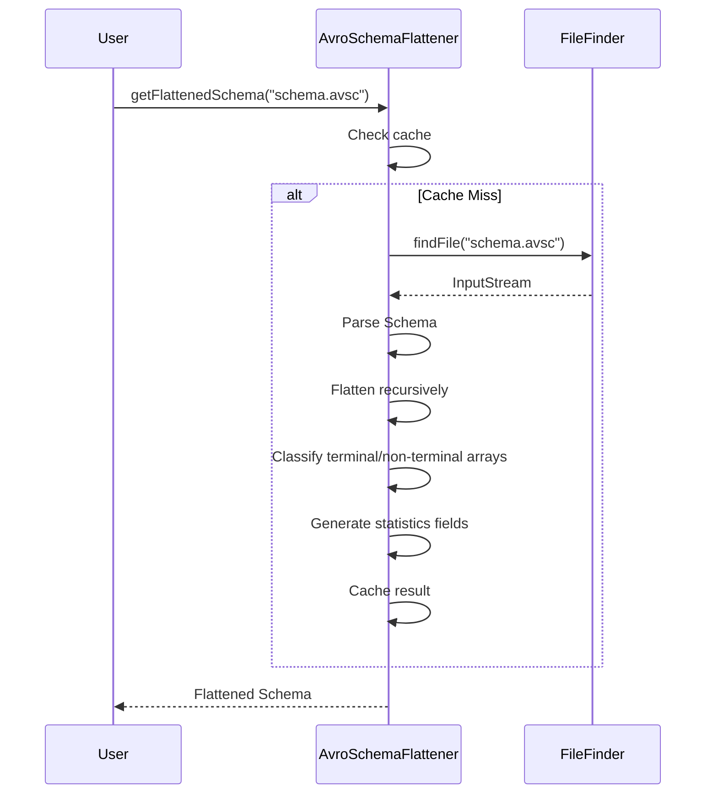
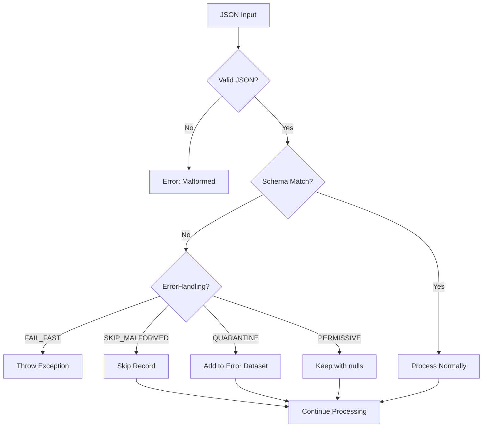

# Data Flow — NexusPiercer
> How data moves through the system
> Last Updated: 2025-12-08

## High-Level Data Flow



---

## Flow 1: Batch JSON Processing

### Sequence



### Data Transformation Example

```
Input JSON:
{
  "user": {
    "name": "Alice",
    "addresses": [
      {"city": "NYC", "zip": "10001"},
      {"city": "LA", "zip": "90001"}
    ]
  }
}

After Flattening:
{
  "user.name": "Alice",
  "user.addresses[0].city": "NYC",
  "user.addresses[0].zip": "10001",
  "user.addresses[1].city": "LA",
  "user.addresses[1].zip": "90001"
}

After Consolidation:
{
  "user_name": "Alice",
  "user_addresses_city": "NYC,LA",
  "user_addresses_zip": "10001,90001",
  "user_addresses_city_count": 2,
  "user_addresses_city_distinct_count": 2
}
```

---

## Flow 2: Streaming from Kafka

### Sequence



---

## Flow 3: Array Explosion

### Sequence



### Data Transformation Example

```
Input JSON:
{
  "orderId": "123",
  "items": [
    {"sku": "A", "qty": 1},
    {"sku": "B", "qty": 2}
  ]
}

After Explosion (2 rows):
Row 1: {"orderId": "123", "items_sku": "A", "items_qty": 1, "_explosion_index": 0}
Row 2: {"orderId": "123", "items_sku": "B", "items_qty": 2, "_explosion_index": 1}
```

---

## Flow 4: Map-to-Iceberg Conversion

### Sequence



---

## Flow 5: Schema Flattening

### Sequence



---

## Data State Transitions

```
┌─────────────────────────────────────────────────────────────────────┐
│                         JSON String                                  │
│  {"user": {"name": "Alice", "scores": [90, 85, 92]}}               │
└─────────────────────────────────────────────────────────────────────┘
                                │
                                ▼ JsonFlattenerConsolidator
┌─────────────────────────────────────────────────────────────────────┐
│                     Flattened JSON String                           │
│  {"user_name": "Alice", "user_scores": "90,85,92",                  │
│   "user_scores_count": 3, "user_scores_avg": 89}                    │
└─────────────────────────────────────────────────────────────────────┘
                                │
                                ▼ Spark from_json + Schema
┌─────────────────────────────────────────────────────────────────────┐
│                       Spark Row                                      │
│  [user_name: String, user_scores: String, user_scores_count: Long]  │
└─────────────────────────────────────────────────────────────────────┘
                                │
                                ▼ IcebergSchemaConverter (optional)
┌─────────────────────────────────────────────────────────────────────┐
│                    Iceberg GenericRecord                            │
│  Record(user_name="Alice", user_scores="90,85,92", ...)            │
└─────────────────────────────────────────────────────────────────────┘
```

---

## Error Handling Flow



---

## Performance Considerations

### Caching Points
1. **Schema Cache:** `AvroSchemaFlattener.schemaCache` — ConcurrentHashMap
2. **Pipeline Schema Cache:** `NexusPiercerSparkPipeline.SCHEMA_CACHE` — ConcurrentHashMap
3. **Converter Cache:** `IcebergSchemaConverter.CONVERTER_CACHE` — ConcurrentHashMap

### Broadcast Variables
- Flattener configuration broadcast to Spark executors
- Schema broadcast for distributed processing

### Partitioning
- Configurable repartition count via `withRepartition(n)`
- Default follows Spark's automatic partitioning
