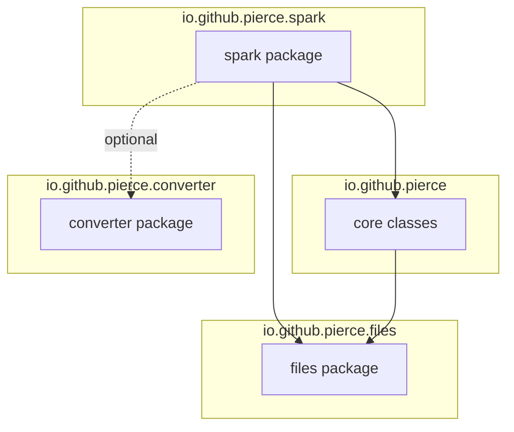

# Dependency Map — NexusPiercer
> Import and dependency relationships
> Last Updated: 2025-12-08

## External Dependencies

### Core Dependencies (from pom.xml)

| Dependency | Version | Purpose | Scope |
|------------|---------|---------|-------|
| Apache Spark | 3.5.0 | Big data processing framework | compile |
| Apache Avro | 1.12.0 | Schema definition and serialization | compile |
| Apache Iceberg | 1.7.1 | Table format for data lakes | compile |
| Jackson | 2.18.0 | JSON parsing and serialization (Apache 2.0) | compile |
| Apache POI | 5.2.5 | Excel file generation | compile |
| Guava | 33.3.1-jre | Google core libraries | compile |
| Commons IO | 2.15.0 | File utilities | compile |
| SLF4J | 2.0.16 | Logging facade | compile |
| Groovy | 4.0.21 | Groovy language support | compile |

> **NOTE:** org.json was removed and replaced with Jackson for license compliance (Apache 2.0 vs JSON License)

### Test Dependencies

| Dependency | Version | Purpose |
|------------|---------|---------|
| JUnit 5 | 5.11.3 | Testing framework |
| Spock | 2.3-groovy-4.0 | Groovy testing framework |
| Mockito | 5.7.0 | Mocking framework |
| AssertJ | 3.24.2 | Fluent assertions |
| jqwik | 1.9.3 | Property-based testing |

---

## Internal Package Dependencies



---

## Class-Level Dependencies

### NexusPiercerSparkPipeline
```
Imports:
├── io.github.pierce.AvroSchemaFlattener
├── io.github.pierce.CreateSparkStructFromAvroSchema
├── io.github.pierce.JsonFlattenerConsolidator
├── io.github.pierce.files.FileFinder
├── org.apache.avro.Schema
├── org.apache.spark.sql.*
├── com.fasterxml.jackson.databind.JsonNode
├── com.fasterxml.jackson.databind.ObjectMapper
└── org.slf4j.Logger
```

### JsonFlattenerConsolidator
```
Imports:
├── com.fasterxml.jackson.databind.JsonNode
├── com.fasterxml.jackson.databind.ObjectMapper
├── com.fasterxml.jackson.databind.node.ArrayNode
├── com.fasterxml.jackson.databind.node.ObjectNode
├── java.util.*
└── java.util.regex.*
```

### MapFlattener
```
Imports:
├── com.fasterxml.jackson.databind.ObjectMapper
├── org.slf4j.Logger
├── java.util.*
└── java.util.concurrent.ConcurrentHashMap
```

### AvroSchemaFlattener
```
Imports:
├── io.github.pierce.files.FileFinder
├── org.apache.avro.Schema
├── org.apache.poi.ss.usermodel.*
├── org.apache.poi.xssf.usermodel.XSSFWorkbook
├── org.slf4j.Logger
├── java.util.*
└── java.util.concurrent.ConcurrentHashMap
```

### IcebergSchemaConverter
```
Imports:
├── org.apache.iceberg.Schema
├── org.apache.iceberg.types.Type
├── org.apache.iceberg.types.Types
├── java.util.*
└── java.util.concurrent.ConcurrentHashMap
```

---

## Dependency Analysis

### Direct Dependencies Per Class

| Class | External Deps | Internal Deps | Total |
|-------|---------------|---------------|-------|
| NexusPiercerSparkPipeline | 4 (Spark, Avro, Jackson, SLF4J) | 4 | 8 |
| JsonFlattenerConsolidator | 1 (Jackson) | 0 | 1 |
| MapFlattener | 2 (Jackson, SLF4J) | 0 | 2 |
| AvroSchemaFlattener | 3 (Avro, POI, SLF4J) | 1 (FileFinder) | 4 |
| IcebergSchemaConverter | 1 (Iceberg) | 2 (Registry, Config) | 3 |

### Coupling Analysis

**Low Coupling (Good):**
- JsonFlattenerConsolidator: Only depends on Jackson, no internal deps
- MapFlattener: Self-contained with Jackson

**Medium Coupling:**
- AvroSchemaFlattener: Depends on FileFinder for schema loading
- IcebergSchemaConverter: Depends on converter infrastructure

**High Coupling (Potential Concern):**
- NexusPiercerSparkPipeline: Depends on multiple internal classes

---

## Layer Violation Check

| From Package | To Package | Allowed? | Notes |
|--------------|------------|----------|-------|
| spark | core | ✅ | Application → Domain |
| spark | files | ✅ | Application → Infrastructure |
| core | files | ✅ | Domain → Infrastructure |
| converter | core | ❓ | Unknown - need to verify |
| files | * | ❓ | Should have no outward deps |

**No layer violations detected** (pending full verification)

---

## Transitive Dependency Risks

### Version Conflicts Managed
The pom.xml includes explicit version management for:
- Jackson (via BOM)
- Commons-IO
- Commons-Compress
- SnakeYAML
- Guava
- Caffeine

### Potential Conflicts (from dependency:tree)
- Hadoop dependencies from Spark may conflict
- Multiple SLF4J bindings possible

---

## Upgrade Considerations

| Dependency | Current | Latest | Breaking Changes |
|------------|---------|--------|------------------|
| Spark | 3.5.0 | 3.5.x | Minor |
| Avro | 1.12.0 | 1.12.x | None |
| Iceberg | 1.7.1 | 1.8.x | Check release notes |
| Java | 17 | 21 | Module system |
