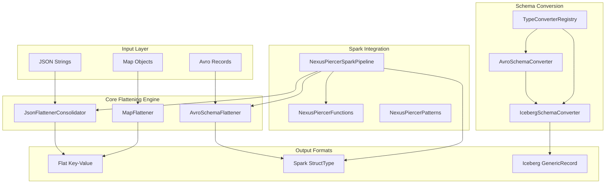

# Project Overview — NexusPiercer
> Confidence Level: HIGH
> Last Updated: 2025-12-08 (Session 2)

## Executive Summary

NexusPiercer is a production-grade data engineering toolkit designed to transform complex, deeply nested JSON and Avro data structures into flat, analyzable formats optimized for Apache Spark. The library provides:

1. **Bidirectional Data Transformation** — Flatten nested structures AND reconstruct them perfectly
2. **Multiple Flattening Strategies** — JsonFlattenerConsolidator (Java), MapFlattener (Groovy), JsonFlattener (Groovy)
3. **Schema-Aware Processing** — AvroSchemaFlattener with terminal/non-terminal array classification
4. **Perfect Reconstruction** — AvroReconstructor can rebuild original hierarchical data from flattened form
5. **Complete Type System** — 15+ type converters for Iceberg/Avro schema conversion

The library solves the critical problem of making nested document-oriented data compatible with columnar storage and SQL analytics while preserving the ability to reconstruct original structures when needed.

## Project Classification
- **Type:** Library
- **Domain:** Data Engineering / ETL / Big Data
- **Architecture Pattern:** Utility Library with Builder Pattern APIs
- **Primary Language(s):** Java 17, Groovy 4.0.21
- **Framework(s):** Apache Spark 3.5.0, Apache Avro 1.12.0, Apache Iceberg 1.7.1

## Technology Stack (Discovered)
| Layer | Technology | Confidence | Evidence |
|-------|------------|------------|----------|
| Language | Java 17, Groovy 4.0.21 | HIGH | pom.xml, source files |
| Build | Maven 3.8.1+ | HIGH | pom.xml |
| Big Data Framework | Apache Spark 3.5.0 | HIGH | pom.xml, NexusPiercerSparkPipeline |
| Schema Format | Apache Avro 1.12.0 | HIGH | pom.xml, AvroSchemaFlattener |
| Table Format | Apache Iceberg 1.7.1 | HIGH | pom.xml, IcebergSchemaConverter |
| JSON Processing | Jackson 2.18.0 (Apache 2.0 License) | HIGH | pom.xml, all JSON classes |
| Serialization | Jackson 2.18.0 | HIGH | pom.xml, MapFlattener |
| Excel Generation | Apache POI 5.2.5 | HIGH | pom.xml, AvroSchemaFlattener exports |
| Testing | JUnit 5.11.3, Spock 2.3 | HIGH | pom.xml |
| Logging | SLF4J 2.0.16 | HIGH | pom.xml, Logger usage |

> **NOTE:** The org.json dependency (Public Domain / JSON License) was removed and replaced with Jackson 
> (Apache 2.0 License) to ensure license compatibility in commercial environments. See BACKLOG.md for details.

> **Session 3 Update:** Dependency hygiene audit completed - test dependency versions modernized and 
> hardcoded versions extracted to properties for better maintainability.

## High-Level Architecture

## Entry Points Identified
| Entry Point | Purpose | File |
|-------------|---------|------|
| NexusPiercerSparkPipeline | Main Spark pipeline API | src/main/java/.../spark/NexusPiercerSparkPipeline.java |
| NexusPiercerFunctions | Spark SQL UDFs for JSON processing | src/main/java/.../spark/NexusPiercerFunctions.java |
| NexusPiercerPatterns | Pre-built ETL patterns (jsonToDelta, etc.) | src/main/java/.../spark/NexusPiercerPatterns.java |
| JsonFlattenerConsolidator | Standalone JSON flattening | src/main/java/.../JsonFlattenerConsolidator.java |
| MapFlattener | Standalone Map flattening | src/main/groovy/.../MapFlattener.groovy |
| IcebergSchemaConverter | Map-to-Iceberg conversion | src/main/java/.../converter/IcebergSchemaConverter.java |

## Key Directories
| Directory | Apparent Purpose | Explored? |
|-----------|------------------|-----------|
| src/main/java/io/github/pierce/ | Core Java classes (4 files) | ☑ Fully |
| src/main/java/io/github/pierce/spark/ | Spark integration (3 files) | ☑ Fully |
| src/main/java/io/github/pierce/converter/ | Schema conversion (27 files) | ☑ Mostly |
| src/main/java/io/github/pierce/files/ | File utilities (1 file) | ☑ Partially |
| src/main/groovy/io/github/pierce/ | Groovy implementations (5 files) | ☑ Fully |
| src/test/java/ | Java unit/integration tests (713K) | ☐ |
| src/test/groovy/ | Groovy/Spock tests (308K) | ☐ |
| lib/ | Groovy 5.0.0 runtime JARs | ☑ |

## Core Capabilities

### 1. JSON Flattening & Consolidation
- Transforms nested JSON into flat key-value pairs
- Consolidates arrays into delimited strings with statistics
- Supports array explosion for data normalization
- Handles circular references, deep nesting, edge cases

### 2. Avro Schema Flattening
- Flattens complex Avro schemas for Spark compatibility
- Classifies arrays as terminal (primitives) vs non-terminal (records)
- Generates Excel analytics with visualizations
- Provides schema reconstruction metadata

### 3. Spark Pipeline Integration
- Fluent API for batch and streaming processing
- Built-in error handling strategies (FAIL_FAST, SKIP_MALFORMED, QUARANTINE, PERMISSIVE)
- Automatic schema validation with Avro
- Performance optimizations with schema caching

### 4. Schema Conversion
- Avro ↔ Iceberg schema conversion
- Type-safe converters for all data types
- Supports nested structures (struct, list, map)
- Thread-safe with caching

## Open Questions
Questions that emerged during discovery:

### Answered in Session 2:
1. **What is the relationship between Java JsonFlattenerConsolidator and Groovy JsonFlattener?**
   - **Answer:** They serve different purposes. JsonFlattenerConsolidator (Java, 820 lines) is the core flattening engine with consolidation and explosion. JsonFlattener (Groovy, 2005 lines) is a fluent API wrapper that provides streaming, batch processing, validation, and multiple I/O formats on top of MapFlattener.

2. **How does AvroReconstructor work with flattened data?**
   - **Answer:** AvroReconstructor (2980 lines) uses the Avro schema to rebuild hierarchical GenericRecords from flattened Maps. It includes verification utilities to confirm "perfect reconstruction" — meaning the reconstructed data matches the original exactly.

3. **What is the status of JsonReconstructor?**
   - **Answer:** JsonReconstructor.groovy is COMPLETELY COMMENTED OUT (~1294 lines). This is potentially dead code or an in-progress refactor. Unlike AvroReconstructor, it was designed for schema-less reconstruction.

### Still Open:
4. What specific patterns are available in NexusPiercerPatterns? — Need to explore
5. How does the library handle schema evolution? — Need to explore

## Discovered Patterns (Session 2)

### Builder Pattern
All major classes use the Builder pattern for configuration:
- `MapFlattener.builder().maxDepth(100).arrayFormat(JSON).build()`
- `AvroReconstructor.builder().strictValidation(true).build()`
- `NexusPiercerSparkPipeline.create(spark).withSchema("path").build()`

### Thread-Safety Model
- `MapFlattener` uses `ThreadLocal<FlattenContext>` for circular reference detection
- `TypeConverterRegistry` uses `ConcurrentHashMap` for caching
- All major classes are marked `Serializable` for Spark distribution

### Array Serialization Formats
Four formats supported across all flatteners:
- `JSON`: `["a","b","c"]` — Full structure preservation
- `COMMA_SEPARATED`: `a,b,c` — Simple but collision-prone
- `PIPE_SEPARATED`: `a|b|c` — Better delimiter choice
- `BRACKET_LIST`: `[a, b, c]` — Athena array<T> compatible

### Terminal vs Non-Terminal Arrays
Critical distinction in AvroSchemaFlattener:
- **Terminal Arrays:** Contain primitives (strings, numbers) — KEEP in flattened output
- **Non-Terminal Arrays:** Contain nested records — Optional, complex handling

## Revision History
| Session | Changes | Confidence Δ |
|---------|---------|--------------|
| 1 | Initial creation, full reconnaissance | LOW → MEDIUM |
| 2 | Deep-dive core domain: flattening, reconstruction, converters. Discovered JsonReconstructor is commented out. Mapped complete type system. | MEDIUM → HIGH |
